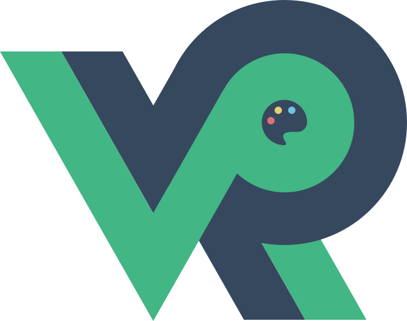

<p align="center"><a href="https://vuejs.org" target="_blank" rel="noopener noreferrer"></a></p>

<p align="center">


</p>

## Quick start

**npm**

```bash
# install
cd my-blog
npm install

# run
npm run dev

# build
npm run build
```

**yarn**

```bash
# install
cd my-blog
yarn install

# run
yarn dev

# build
yarn build
```

**感谢:** [午后杂院](https://www.recoluan.com/)